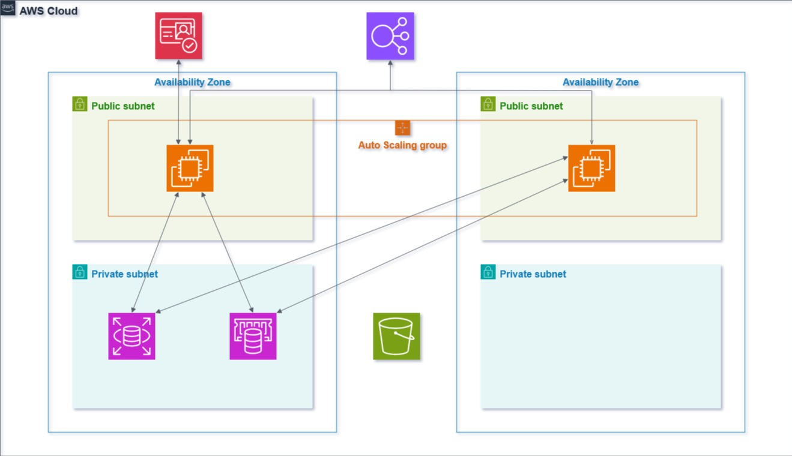

# Terraform Shopping Website Deployment

This project provisions a shopping website on AWS using Terraform.  
It deploys the following components:

- **VPC Module**: Creates VPC, public/private subnets, NAT, Internet Gateway, and routing.
- **Security Groups Module**: Defines security groups for EC2, RDS, ALB, and Redis.
- **RDS Module**: Provisions Amazon RDS MySQL database with initial schema and data.
- **Redis Module**: Provisions Amazon ElastiCache Redis cluster for caching.
- **Cognito Module**: Creates Cognito User Pool, App Client, and Domain for authentication.
- **ALB Module**: Application Load Balancer configured with HTTPS (ACM certificate required).
- **ASG Module**: Auto Scaling Group with Launch Template running EC2 web servers.
  - EC2 instances fetch website package from S3 (`s3://your-bucket/New-Bootstrap.zip/New-Bootstrap.zip`).
  - User data injects Cognito configuration directly into `index.html`.



*Shows EC2, ALB, ASG, Cognito, RDS, and ElastiCache workflow.*

## Prerequisites

- Terraform >= 1.3
- AWS credentials configured (`aws configure` or environment variables).
- An S3 bucket with the website zip uploaded (update bucket name/path in `modules/asg/user_data.sh.tftpl`).
- ACM Certificate ARN for your ALB domain.
- Check Structure file [Link here](https://github.com/Mojahidmohd/Shopping-Site/Structure)
 to get information about project structure. 

## Usage

1. Clone/unzip the project:
   ```bash
   unzip terraform_full_project.zip -d terraform_project
   cd terraform_project
   ```

2. Initialize Terraform:
   ```bash
   terraform init
   ```

3. Update `variables.tf` file with values for variables (example below).

4. Apply infrastructure:
   ```bash
   terraform apply
   ```

## Example `variables.tf`

```hcl
aws_region         = "us-east-1"
project_name       = "shopping"
db_username        = "admin"
db_password        = "YourStrongPassword123"
acm_certificate_arn = "arn:aws:acm:me-south-1:123456789012:certificate/xxxxxxxx-xxxx-xxxx-xxxx-xxxxxxxxxxxx"
```

## Notes

- EC2 runs in **public subnets**, ALB is in public and routes traffic to EC2.
- To run EC2 in **private subnets** NAT Gateway is required to manage EC2 and interconnect with the internet.
- NAT Gateway is required for EC2 to access S3 for downloading the site package.
- Cognito integration: Values are injected into `index.html` automatically at boot.


