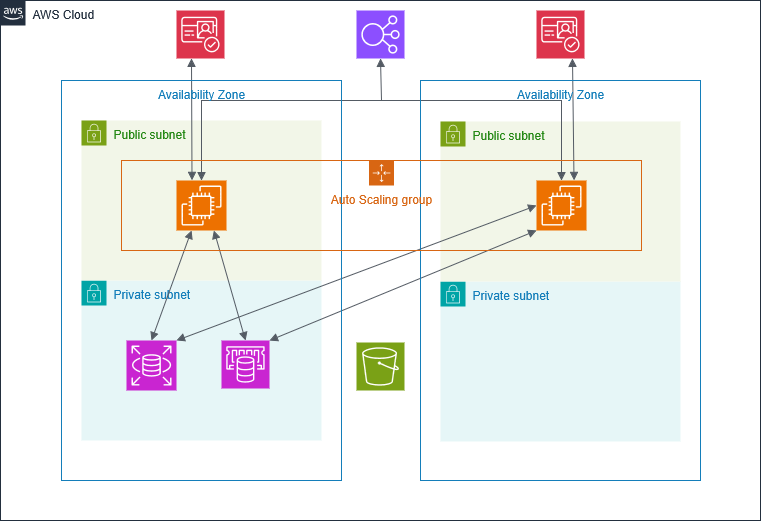

# Terraform AWS Shopping Website & Web Application Deployment

This project demonstrates how to deploy a **shopping website** and a **scalable, secure web application** on AWS using **Terraform**.  
It provisions multiple AWS services to ensure **high availability, security, performance, and cost optimization** (Free Tier friendly where possible).

---

## Project Overview

By following this project, you will:

- Understand how to provision AWS resources using Terraform  
- Deploy a **shopping website** with authentication and caching  
- Learn how to set up **EC2 instances behind an ALB** with Auto Scaling  
- Implement **secure user authentication with Amazon Cognito**  
- Integrate **Amazon RDS** for database and caching optimization  
- Gain hands-on experience building a complete AWS cloud infrastructure  

---

## 1. Project Details

### Architecture Overview
- **Tier 1 (Web Tier)**  
  - **Application Load Balancer (ALB)** in **public subnets**  
  - **EC2** instances in **public subnets**   
  - **Amazon Certificate Manager (ACM)** TLS certificate for HTTPS  
  - **Cognito** for website access control using user ID and password

- **Tier 2 (Application Tier)**  
  - **EC2** instances managed by **Auto Scaling Group (ASG)**  
  - Secure access via **AWS SSM Session Manager** (no open SSH ports)   

- **Tier 3 (Database Tier)**  
  - **Amazon RDS** MySQL in private subnets  
  
- **Supporting Services**  
  - **S3**: Application artifacts, static content, and logs  
  - **IAM**: Fine-grained roles for EC2, S3, ALB logging, and SSM    

---

## Key Services Used

- **VPC Module** – Networking (VPC, subnets, NAT, routing, gateways)  
- **Security Groups Module** – Secure inbound/outbound rules for EC2, ALB, RDS, Redis  
- **EC2 + ASG Module** – Web application servers with Auto Scaling  
  - **User data** configures EC2 instances to fetch website package from S3 (`s3://your-bucket/WebSite.zip`)  
  - **User data** injects **Cognito** configurations into `index.html` automatically at boot 
- **Application Load Balancer (ALB) Module** – HTTPS-enabled traffic distribution (ACM certificate required)  
- **Amazon Cognito Module** – Authentication and user management  
- **Amazon RDS (MySQL) Module** – Managed relational database with initial schema & data  
- **Terraform Modules Structure** [here](./Structure.txt)
- **Website Structure** [here](./Website-Structure.txt)
---

## Architecture Diagram

  
*Shows EC2, ALB, ASG, Cognito, RDS, and ElastiCache workflow.*

---

## Features

- Fully automated deployment with **Terraform**  
- **High availability** and **scalability**  
- Secure authentication with **Cognito**  
- Optimized database performance with **RDS**  
- Integration of shopping website frontend with Cognito and database backend  
- **Cost** – Free Tier Friendly

---

## Prerequisites

- Terraform >= 1.3  
- Download `Terraform_Full_Project.zip`
- Change `<Your-Region>` in `/variables.tf`
- ACM Certificate ARN for your ALB domain in `/variables.tf`
- Create your own profile and change `<Your-Profile>` in `/provider.tf` (create and save your credentials following AWS guidelines)
- Download `WebSite.zip` and upload to S3 bucket (update bucket path in `/modules/asg/user_data.sh.tftpl`)  

---

## Example `/variables.tf`

```hcl
aws_region          = "us-east-1"
project_name        = "shopping"
db_username         = "admin"
db_password         = "YourStrongPassword123"
acm_certificate_arn = "arn:aws:acm:us-east-1:123456789012:certificate/xxxxxxxx-xxxx-xxxx-xxxx-xxxxxxxxxxxx"
```

---

## Example `/provider.tf`

```hcl
provider "aws" {
  region  = var.aws_region
  profile = "<Your-Profile>"
}
```

---

## Example `/modules/asg/user_data.sh.tftpl`

```bash
aws s3 cp s3://<Your-Bucket>/WebSite.zip /tmp/WebSite.zip
```

---

## Getting Started

1. **Clone or Unzip** the project:
   ```bash
   unzip Terraform_Full_Project.zip -d terraform_project
   cd terraform_project
   ```

2. **Initialize Terraform**:
   ```bash
   terraform init
   ```

3. **Review the Plan**:
   ```bash
   terraform plan
   ```

4. **Apply the Configuration**:
   ```bash
   terraform apply
   ```

5. **Access the App** using the ALB endpoint once deployed.

6. **Remember to destroy the project after finish**:
   ```bash
   terraform destroy
   ```

---

## Instance Types Used

Update instance depend on **region** for **free tier**

- **EC2**: t3.micro
- **RDS**: db.t3.micro, single-AZ

---

## Notes

- EC2 runs in **public subnets**, ALB routes traffic to EC2.   
- Cognito integration injects values into `index.html` during boot.  
- RDS tables created: products and cart

---

## Options

- Modify instance types and other parameters in `variables.tf` as needed
- Modify ASG sizes in `/modules/asg/main.tf`
- To run EC2 in **Private Subnet** you have to:
  - Configure **SSM** to access **EC2 instance** and **S3**
  - Update ASG with **Private Subnet**
- Customize the website by updating the `WebSite.zip` package and uploading it to your S3 bucket

---

## Troubleshooting

- Ensure your AWS credentials and region are correctly set in the provider
- Verify the ACM certificate is in the same region as your ALB
- Check security group rules to allow necessary traffic
- Review Terraform output for any errors during deployment
- Validate Cognito configuration if you experience issues with sign-up or login
- Cognito uses **email** verification → check your inbox for the verfication code

---

## Resources

- Bootstrap from a [Bootstrap](https://getbootstrap.com)
- Images from [Getty Images](https://www.gettyimages.com/)

---

## License

This project is licensed under the **MIT License**.  
